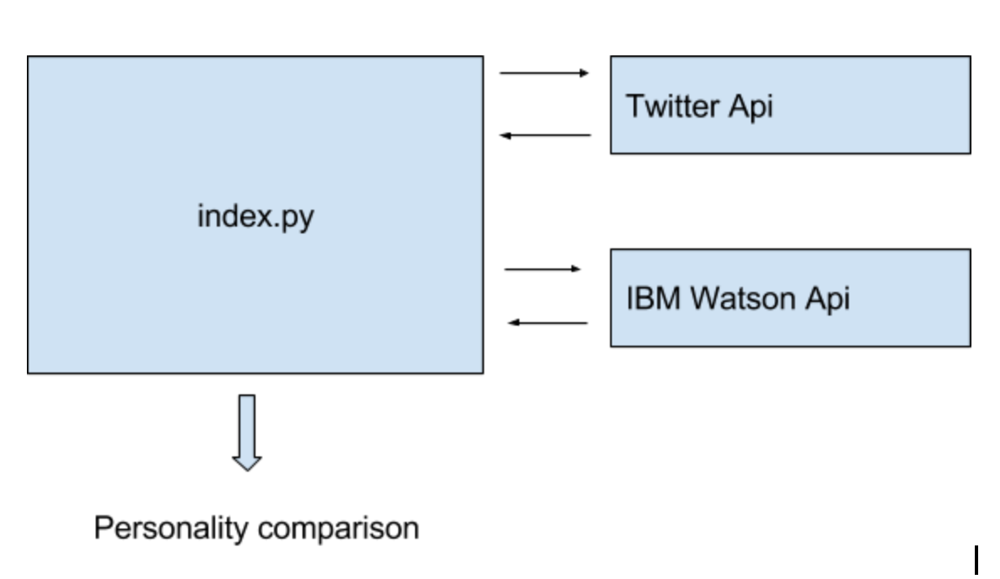

# Watson Twitter Integration
### Background
I wanted to see how simple it is getting up and running with IBM watson's open source AI api's. Turns out you can do some really powerful stuff in no time.

The goal of the project is two compare two individuals using Watson's PersonalityInsights api.

Breakdown:
* Fetches last 200 tweets from individuals to be compared.
* Fetches personality insight data tree from Watson for each individual
* Compares the personality data on a number of personality dimensions and pretty prints output

## Example Output:
`-----------Intellect-----------` 
@elonmusk 0.9958000985561515  
@realDonaldTrump 0.9874894652235615  
diff: 0.008310633332589967 

`-----------Cautiousness-----------` 
@elonmusk 0.9131838482235541 
@realDonaldTrump 0.9398338676696929  
diff: 0.026650019446138762 

`-----------Immoderation-----------` 
@elonmusk 0.1324209789076068 
@realDonaldTrump 0.07541715219692319 
diff: 0.0570038267106836 

`-----------Emotionality-----------` 
@elonmusk 0.14008885156458956 
@realDonaldTrump 0.19716503621395137 
diff: 0.057076184649361816 

`-----------Adventurousness-----------` 
@elonmusk 0.790031412347683 
@realDonaldTrump 0.8511258200291241 
diff: 0.06109440768144103 
